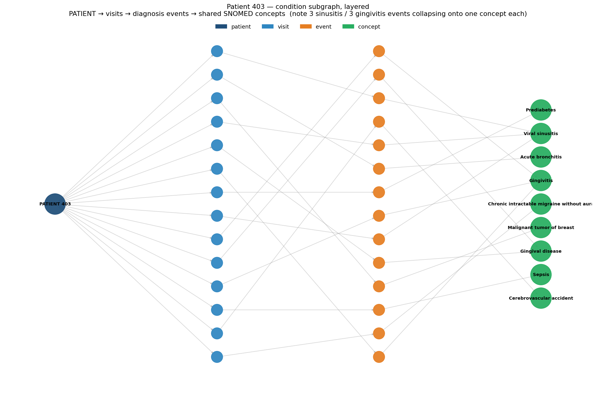

# Tutorial 4 — Build a Tiny Graph

*EXAI-KG hands-on series · for new interns · ~70 min*
*Companion to `Intern_Onboarding_Plan.md` (Tier C entry). Goal: turn patient 403 from a pile of OMOP rows into an actual **knowledge graph** — nodes and edges in NetworkX — by following the project's real edge contract (`Phase2_Taxonomy_FULL.md` §5). This is the first tutorial where you **build** instead of query.*

Everything so far was preparation. You've read the tables, decoded the vocabularies, and seen the shared Concept node. Now you assemble them into the thing the whole project is about. We'll build **one static graph** for one patient — no time dimension yet (that's the unsolved frontier; see the end).

**Setup:** same header, plus NetworkX (`pip install networkx matplotlib`).

```python
import pandas as pd, networkx as nx
from pathlib import Path
OMOP = Path(r"W:\dev\EXAI-KG-OMOP\EXAI-KG\data\processed\omop_parquet")
def load(t): return pd.read_parquet(OMOP / f"{t}.parquet")
PID = 403
```

---

## Step 1 — The contract you're building to

The taxonomy spec says the graph is a list of edges, each a tuple: **`(source, target, edge_type)`** (plus a timestamp we'll ignore until Tutorial 6). There are three families of edge:

| Family | Edge types | Meaning |
|---|---|---|
| **Backbone** | `HAS_ENCOUNTER`, `NEXT_ENCOUNTER`, `HAS_FIRST/LAST_ENCOUNTER` | patient → visits, and visit → next visit (the time spine) |
| **Descriptive** | `RECORDS_CONDITION`, `ADMINISTERED`, `PERFORMED`, `MEASURED`, `OBSERVED` | visit → what happened in it |
| **Semantic** | `MAPS_TO` | event → its shared Concept node (the normalization from Tutorial 3) |

Node ids are **namespaced by type** so they never collide: `patient_403`, `visit_22971`, `cond_55012`, `concept_132797`, and so on. That's the whole design. Let's emit it.

---

## Step 2 — Emit the edges (the generator)

This is a miniature version of the "edge-list generator" Abem builds for the whole dataset. For 403 only:

```python
def mine(df): return df[df.person_id == PID]
v = mine(load("visit_occurrence"))
events = {  # table -> (id column, node prefix, edge type, concept column)
    "condition_occurrence": ("condition_occurrence_id","cond","RECORDS_CONDITION","condition_concept_id"),
    "drug_exposure":        ("drug_exposure_id","drug","ADMINISTERED","drug_concept_id"),
    "measurement":          ("measurement_id","meas","MEASURED","measurement_concept_id"),
    "procedure_occurrence": ("procedure_occurrence_id","proc","PERFORMED","procedure_concept_id"),
    "observation":          ("observation_id","obs","OBSERVED","observation_concept_id"),
}
edges = []

# backbone: patient -> visit, and visit -> next visit
for _, r in v.iterrows():
    edges.append((f"patient_{PID}", f"visit_{r.visit_occurrence_id}", "HAS_ENCOUNTER"))
    if pd.notna(r.preceding_visit_occurrence_id):
        edges.append((f"visit_{int(r.preceding_visit_occurrence_id)}", f"visit_{r.visit_occurrence_id}", "NEXT_ENCOUNTER"))

# descriptive + semantic: visit -> event -> concept
for table,(idc,prefix,etype,ccol) in events.items():
    for _, r in mine(load(table)).iterrows():
        ev = f"{prefix}_{r[idc]}"
        if pd.notna(r.visit_occurrence_id):
            edges.append((f"visit_{int(r.visit_occurrence_id)}", ev, etype))
        if pd.notna(r[ccol]) and int(r[ccol]) != 0:
            edges.append((ev, f"concept_{int(r[ccol])}", "MAPS_TO"))

el = pd.DataFrame(edges, columns=["source","target","edge_type"])
print("total edges:", len(el))
print(el.edge_type.value_counts().to_string())
```

```
total edges: 1826
MAPS_TO              821
OBSERVED             343
MEASURED             312
PERFORMED            131
HAS_ENCOUNTER         94
NEXT_ENCOUNTER        93
ADMINISTERED          18
RECORDS_CONDITION     14
```

You just generated **1,826 edges for a single patient.** Notice `MAPS_TO` (821) dominates — almost every event points to a concept. And the **93** `NEXT_ENCOUNTER` edges are exactly the backbone you spotted in Tutorial 2 (94 visits, first one has no predecessor).

---

## Step 3 — Load it into NetworkX

The whole point of the `(source, target, edge_type)` shape is that it drops straight into a graph library:

```python
G = nx.from_pandas_edgelist(el, create_using=nx.MultiDiGraph, edge_attr="edge_type")
print(f"{G.number_of_nodes():,} nodes, {G.number_of_edges():,} edges")

import collections
print(collections.Counter(n.split('_')[0] for n in G.nodes()))
```

```
1,056 nodes, 1,826 edges
Counter({'obs': 343, 'meas': 312, 'concept': 140, 'proc': 134, 'visit': 94, 'drug': 18, 'cond': 14, 'patient': 1})
```

**One patient is a 1,056-node graph.** Sit with that — at 1,174 patients the full graph is large, which is exactly why the project cares about CPU vs GPU (NetworkX now, cuGraph later) and why event granularity (raw events vs. summarized state) is an open question. You're feeling the scale problem firsthand.

---

## Step 4 — See entity normalization *in the graph*

In Tutorial 3 you proved normalization with counts. Now watch it happen structurally. The **140 concept nodes** absorb all **821** `MAPS_TO` edges — many events, far fewer concepts. Find the concepts that pull in the most events:

```python
shared = [(n, G.in_degree(n)) for n in G.nodes() if n.startswith("concept_")]
shared.sort(key=lambda x: -x[1])
print("most-shared concept nodes (in-degree):", shared[:3])
```

```
most-shared concept nodes (in-degree): [('concept_4141448', 34), ('concept_4064377', 20), ('concept_4104747', 18)]
```

Decode those ids (Tutorial 3's lookup) and they're **External beam radiation therapy (34×)**, **Depression screening (20×)**, **Physical examination (18×)**. The radiation-therapy hub is 403's **breast-cancer treatment** showing up as a high-centrality node — 34 separate events collapsing onto one concept. *That's a hub you can only see because of normalization*, and it's precisely the kind of structure Tutorial 5's centrality metric is built to surface. Even within one patient, the shared node turns repetition into signal.

---

## Step 5 — Draw a readable slice

The full 1,056-node graph is too dense to eyeball, so visualize just the **condition** layer: patient → visits-with-a-diagnosis → diagnosis events → shared SNOMED concepts.

```python
# (full plotting code in the repo; the shape is what matters)
```



Read it left to right — it's the taxonomy made visible:

- **Dark node (left):** the patient.
- **Blue column:** her visits.
- **Orange column:** the 14 individual diagnosis events.
- **Green column (right):** the shared SNOMED concepts.

The key thing to *see*: the right side has **fewer nodes than the middle**. Her 14 diagnosis events fold into **9** concepts — the three "Viral sinusitis" events and three "Gingivitis" events each converge on a single green node. That convergence is entity normalization drawn out in space. Multiply it across 1,174 patients and those green nodes become the hubs that connect strangers who share a diagnosis — the substrate the topology metrics run on.

---

## Step 6 — Honest wrinkles (don't skip these)

Building real graphs means meeting real mess:

1. **3 procedures went missing from the backbone.** You emitted **131** `PERFORMED` edges but 403 has **134** procedures — three rows have a null `visit_occurrence_id`, so they had no visit to attach to. The spec (`Phase2_Taxonomy_FULL.md` §5) says to hang such orphans directly off the patient and log the count, rather than silently drop them. We dropped them here; the real generator shouldn't. **Lesson: always reconcile your edge counts against your row counts.**
2. **This is one static graph.** There's no time in it yet — it's everything 403 ever had, flattened into a single snapshot. The project's actual thesis is watching this graph *change over time*, which needs the snapshot decisions that aren't made yet (Tutorial 6).
3. **Scale is real.** 1,056 nodes per patient × 1,174 patients is why the open question "raw events vs. summarized state" matters — it directly sets how big and dense the whole graph gets.

---

## Checkpoint — you can now build

- **Generate a knowledge graph from OMOP** by emitting `(source, target, edge_type)` tuples per the taxonomy contract.
- **Load and inspect it in NetworkX** — node/edge counts, node types, in-degree.
- **Recognize normalization structurally** — many events, few shared concept hubs (radiation therapy at in-degree 34).
- **Stay honest about the wrinkles** — orphaned events, scale, and the fact that this is a single static snapshot.

This is the **static-graph capstone** from the onboarding plan, in miniature. Do it for one patient here; doing it cleanly for *all* patients (with the orphan handling and the full node table) is the bounded task that earns you the temporal frontier.

**Next:** *Tutorial 5 — Measure the Shape*, where you compute the four topology metrics (entropy, branching, motif, centrality) on this graph and learn to read structure as signal — turning that radiation-therapy hub into a number.
