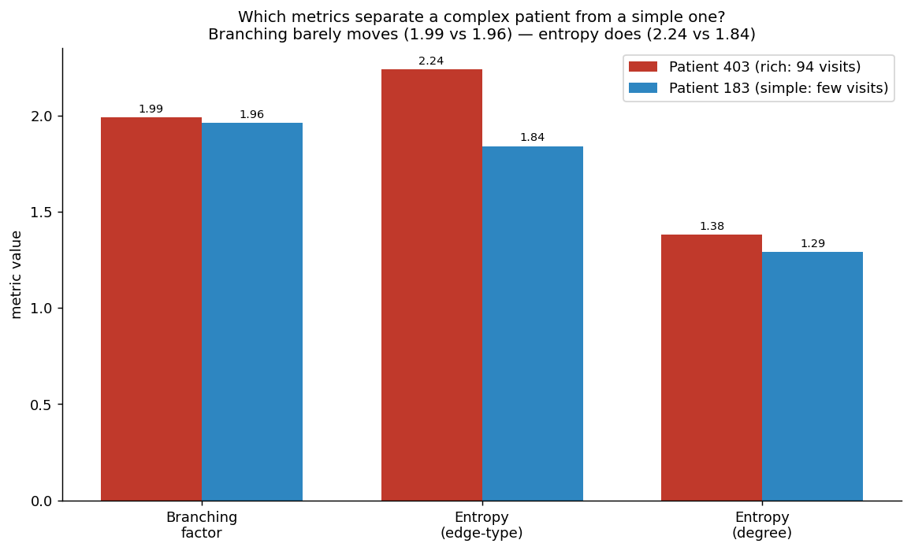

# Tutorial 5 — Measure the Shape

*EXAI-KG hands-on series · for new interns · ~70 min*

*Goal: compute the project's four **topology metrics** — centrality, branching, entropy, motif — on the graph you built in Tutorial 4, learn to read **structure as signal**, and — just as important — learn to be **skeptical**, because not every metric actually means something.*

The project's whole bet is that the *shape* of a patient's graph carries clinical meaning — that you can see trouble in the topology before any model makes a prediction. This tutorial is where you test that bet with your own hands, on real numbers. We compute each metric on **patient 403** (rich: 94 visits) and a **simple patient, 183** (a handful of visits), and ask: *does the metric tell them apart?*

**Setup:** reuse the `build(pid)` graph generator from Tutorial 4 (it returns the NetworkX graph for one patient). Add `numpy`.

---

## The four metrics (one-line each, from `Phase2_Graph_Primer.md`)

- **Centrality** — which node is the hub everything connects through?
- **Branching factor** — how much does the graph fan out (average out-degree)?
- **Entropy** — how varied / disordered is the graph?
- **Motif frequency** — which small recurring sub-patterns appear?

We'll take them in order of *how trustworthy they turn out to be* — best first.

---

## Step 1 — Centrality: find the hub (the most useful one)

Centrality scores how connected/important each node is. The simplest version is **in-degree** — how many events point at a node. You already met 403's hub in Tutorial 4; now compare it to 183's:

```python
import networkx as nx
for pid in (403, 183):
    G, _ = build(pid)
    hub = max(G.in_degree(), key=lambda x: x[1])
    print(pid, "->", hub)
```

```
403 -> ('concept_4141448', 34)   # External beam radiation therapy
183 -> ('concept_3024171', 4)    # Respiratory rate
```

This is the metric that most directly delivers the project's promise. 403's graph **revolves around radiation therapy** (her breast-cancer treatment) — 34 events converge there. 183's graph revolves around a **routine vital sign**. Without reading a single note, the hub tells you what each patient's care is *about*. **That's "structure as explanation" working.** Centrality is the metric to trust most on a static graph.

---

## Step 2 — Branching factor: a metric that *fails* (and why that's the lesson)

Branching = average out-degree over non-leaf nodes — how much the graph fans out. Compute it for both:

```python
import numpy as np
for pid in (403, 183):
    G, _ = build(pid)
    outs = [d for _, d in G.out_degree() if d > 0]
    print(pid, "branching:", round(np.mean(outs), 2))
```

```
403 branching: 1.99
183 branching: 1.96
```

**Nearly identical** — 1.99 vs 1.96 — even though 403's graph is 10× bigger. Don't paper over this; understand it. Our graph is mostly **chains**: `patient → visit → event → concept` is a path where most nodes have out-degree ~1–2, regardless of how sick the patient is. So branching is pinned near 2 for everyone and **carries almost no signal here**.

> **The real lesson:** a metric is only useful if it *varies* with the thing you care about. Branching doesn't separate complex from simple patients on this graph structure, so reporting it as a complexity measure would be misleading. **Always check that a metric discriminates before you trust it.** This is exactly the kind of thing the team needs to validate before building on these numbers.

---

## Step 3 — Entropy: a metric that *works*

Shannon entropy measures disorder/variety. Compute it over the **mix of edge types** — a graph that's all one relationship type is orderly (low entropy); one with many relationship types in balance is varied (high entropy):

```python
def entropy(series):
    p = series.value_counts(normalize=True).values
    return round(-(p * np.log2(p)).sum(), 2)

for pid in (403, 183):
    _, el = build(pid)
    print(pid, "edge-type entropy:", entropy(el.edge_type))
```

```
403 edge-type entropy: 2.24
183 edge-type entropy: 1.84
```

The formula is just `−Σ p·log₂(p)` over the proportions of each edge type — the standard information-theory measure. Here it **does** separate the patients: 403's care involves a richer, more balanced mix of relationship types (conditions, drugs, labs, procedures, observations all in play) → higher entropy; 183's is dominated by a few → lower. Unlike branching, entropy moves with complexity. This is the metric the project's "rising complexity" story is built on — and on a static snapshot, at least, it behaves.

---

## Step 4 — Motif frequency: real, but the fuzziest

A motif is a small recurring sub-shape. The usual starting point is the **triangle**. Count them (in the undirected projection):

```python
for pid in (403, 183):
    G, _ = build(pid)
    print(pid, "triangles:", sum(nx.triangles(nx.Graph(G)).values()) // 3)
```

```
403 triangles: 93
183 triangles: 3
```

Big difference — but **be suspicious of it.** Where do triangles even come from in a `patient → visit → event → concept` graph? Almost all of them are one boring pattern: the patient connects to *every* visit, and consecutive visits are linked by `NEXT_ENCOUNTER`, so `patient–visitA–visitB` forms a triangle for every adjacent pair. 403 has 93 visit-links → ~93 triangles. **The motif count is mostly measuring graph size and the patient-hub structure, not anything clinical.**

> **Lesson:** raw motif counting needs a *defined motif of interest* (e.g. "condition → drug → repeat-condition," a treatment-failure signature) to mean anything — and those signatures are most meaningful on the **temporal** graph the team hasn't built yet. Of the four metrics, motif frequency is the least settled. Flag it as promising-but-undefined, not as a result.

---

## Step 5 — Read the scoreboard

| Metric | Patient 403 (rich) | Patient 183 (simple) | Separates them? |
|---|---|---|---|
| Hub (in-degree centrality) | radiation therapy, **34** | respiratory rate, **4** | ✅ and clinically meaningful |
| Edge-type entropy | **2.24** | **1.84** | ✅ |
| Branching factor | 1.99 | 1.96 | ❌ pinned near 2 |
| Triangles (motif) | 93 | 3 | ⚠️ but mostly an artifact |



The figure makes the headline visible: **branching barely moves while entropy clearly does.** The meta-lesson of this whole tutorial: *structure can be signal — but you have to prove which structure.* Centrality and entropy earn their place; branching doesn't separate; motif needs a definition. An intern who reports all four as "complexity measures" without checking has missed the point. Skepticism is part of the method.

---

## Step 6 — The ceiling: these are *static* snapshots

Everything above describes **one frozen graph** — everything 403 ever had, flattened. But the project's actual thesis isn't "complex patients have higher entropy." It's **topology changing over time**:

- entropy **rising** along a patient's trajectory as their picture gets more chaotic,
- the hub **shifting** — centrality moving from routine care to (say) the cancer node at the moment things turn,
- motifs that are signatures of a *process failing*, like the injected sepsis `Lab_Overload_Delay`.

You **cannot compute those yet**, and not because the code is hard — because the definitions aren't decided. "Entropy over time" needs a **snapshot interval** (per visit? per week?) and an **event granularity** (raw events? summarized state?), and the team hasn't chosen them (`Phase2_Taxonomy_PRD.md`, open questions 1–2). Pick differently and the curves change. So the temporal metrics are a **design problem before they're a coding problem** — which is exactly where Tutorial 6 takes you.

---

## Checkpoint — you can now measure and judge

- **Compute all four metrics** on a patient graph (centrality, branching, entropy, motif).
- **Read structure as signal** — the hub tells you what care is *about* (radiation therapy vs. a vital sign).
- **Be skeptical** — branching doesn't discriminate here, and triangle counts are mostly a structural artifact. Validate that a metric varies with what you care about before trusting it.
- **Know the ceiling** — these are static; the project's real claim (entropy-over-time, centrality shift) is blocked on undecided snapshot/granularity definitions.

**Next:** *Tutorial 6 — The Temporal Frontier.* No new code to run — this is the design discussion that turns you from someone who can follow the project into someone who can help decide it: what *is* a snapshot, what *is* a node, and what would it take to make "topology over time" real.
