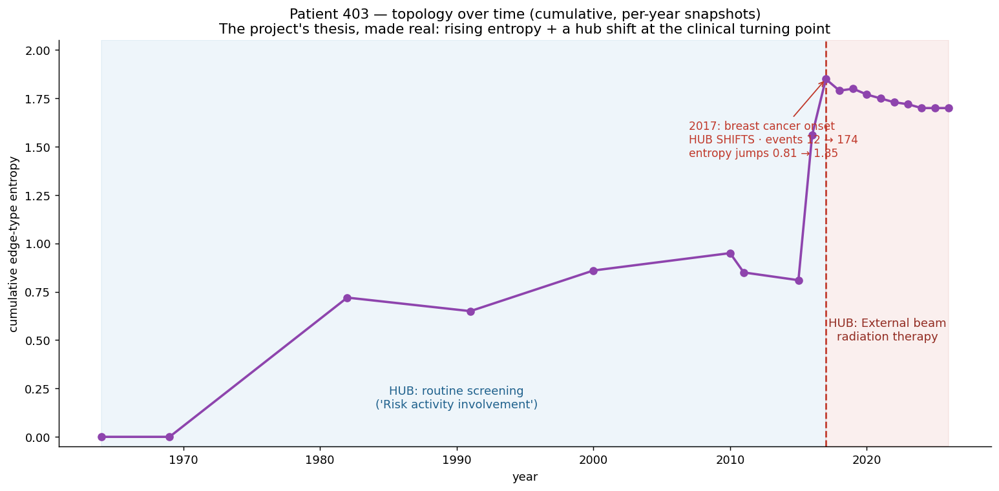

# Tutorial 6 — The Temporal Frontier

*EXAI-KG hands-on series · for new interns · ~60 min, mostly thinking*
*Companion to `Intern_Onboarding_Plan.md` (the deferred open question). Goal: see the project's core thesis demonstrated on real data, then understand **exactly what the team hasn't decided yet** — well enough to have an opinion. This is the tutorial that turns you from someone who can follow the project into someone who can help **decide** it.*

This one is different. Tutorials 1–5 had right answers you could check. This one doesn't, because **the project itself doesn't have them yet.** You've earned your way here by building and measuring a static graph; now you meet the unsolved part.

---

## Step 1 — The thesis, made real

Everything so far was static — one frozen graph. The project's actual bet is **topology over time**. Here it is, computed on patient 403: walk her timeline year by year, and at each point measure the *cumulative* graph's entropy and find its hub.



```
year | cum_events | entropy | current hub
1982 |     5 | 0.72 | Risk activity involvement (routine screening)
2000 |     7 | 0.86 | Risk activity involvement
2015 |    12 | 0.81 | Risk activity involvement
2016 |    68 | 1.56 | Risk activity involvement
2017 |   174 | 1.85 | External beam radiation therapy   <-- HUB SHIFTS
2026 |   818 | 1.70 | External beam radiation therapy
```

Read what happens in **2017**: her breast cancer begins, her event count explodes (12 → 174), entropy jumps (0.81 → 1.85), and the **hub shifts** — the node everything revolves around moves from routine screening to **radiation therapy**. That hub shift *is* the clinical turning point, visible in the graph's shape, with no model and no prediction. **This is the entire EXAI-KG hypothesis, working, on one real patient.** When the project says "the structure is the explanation," this curve is what they mean.

So why isn't the project done? Because that curve rests on a stack of choices nobody has agreed to.

---

## Step 2 — Every number above is a decision in disguise

I made at least four choices to draw that chart. Change any one and the curve changes:

1. **Cumulative vs. windowed.** I let the graph *accumulate* (everything up to year Y). A *sliding window* (only the last 12 months) would show a very different shape — entropy would fall during quiet years instead of plateauing.
2. **Per-year snapshots.** I snapshotted yearly. Per-*encounter* (the PRD's tentative default) would give 94 points instead of 19, with different dynamics. Per-*week* would be different again — and mostly empty.
3. **Entropy of what?** I used the mix of *edge types*. Entropy of the *degree distribution*, or of *concept domains*, would each tell a different story.
4. **Hub = raw event count.** The "hub" was just the most-pointed-to concept. Early on that's "Risk activity involvement" — a routine screening observation that's frequent but not clinically central. A different centrality measure (betweenness, PageRank) might never call it the hub.

**None of these is obviously right.** That's not sloppiness — it's the actual research frontier. The chart is *an* answer, not *the* answer.

---

## Step 3 — The real open forks (now you can reason about them)

These are the decisions on the table (`Phase2_Taxonomy_PRD.md` open questions, the worklog). You now know enough to form a view on each.

**Fork 1 — Event granularity (D1).** One node per *raw event*, or aggregate into *patient-state* nodes per timestep? You felt this in Tutorial 4: raw events made one patient a 1,056-node graph, dominated by hundreds of measurements and observations. That's why 403's early "hub" was a screening observation — sheer volume, not importance. Aggregation would shrink the graph and might sharpen the signal — or wash it out. *This single choice changes what entropy and centrality even measure.*

**Fork 2 — Snapshot interval (D2).** Per-encounter, fixed window, or cumulative? Entropy-over-time is **undefined** until this is set — you saw three different possible curves in Step 2. The PRD leans per-encounter (it matches the `NEXT_ENCOUNTER` backbone); is that right for a metric meant to catch *gradual* overload?

**Fork 3 — Property graph now, RDF/FHIR later?** You built in NetworkX (property graph). Xiao's FHIR-RDF approach is richer but heavier. For the CPU prototype, is the simpler model enough?

**Fork 4 — What does "overload" even mean?** This is the deepest one. `Grounding_Map.md` flags it: the project says "**cognitive** overload" (the clinician's mental load) but the injected perturbation models a **system** delay (a lab queue backing up). Those aren't the same thing. The term drifts across the team's own documents. Until it's pinned down, you can't say what the topology is supposed to be detecting. *An intern who notices this slippage is already contributing.*

---

## Step 4 — The honest gaps nobody has closed

Don't leave this tutorial thinking the curve in Step 1 proves the project works. It doesn't, and here's what's still missing:

- **The perturbation hasn't been detected.** The whole point of the injected sepsis `Lab_Overload_Delay` is to be *ground truth* — a known signal the topology metrics should catch. **No one has shown the metrics actually detect it.** (Recall Tutorial 2: patient 403's sepsis visit was nearly empty — the planted signal may be subtle or sparse.) Demonstrating detection on the 33-patient sepsis cohort is the real validation, and it's unbuilt.
- **The metrics may be measuring volume, not complexity.** 403's entropy is driven heavily by high-count observations and measurements. Is rising entropy a *clinical* signal or just "more labs got ordered"? Untested.
- **There's no evaluation method.** Design-science research (the project's paradigm, per `Grounding_Map.md` row 15) demands you *prove the artifact works* against stated criteria. Those criteria don't exist yet. "The hub shifted at the cancer" is a compelling anecdote, not evidence.

---

## Step 5 — How you actually contribute now

You're past spectating. Concrete entry points, smallest-first:

1. **Run the static-graph capstone cleanly for all patients** — the bounded task from the onboarding plan (full node/edge tables, handle the orphaned events from Tutorial 4, validate counts). Low-risk, high-value, and it's the foundation everything else needs.
2. **Try to detect the perturbation.** Build the per-encounter entropy series for the 33 sepsis patients and see whether the perturbed ones look different. Even a negative result is a real finding.
3. **Propose and defend a snapshot + granularity choice** (Forks 1–2) with a written rationale. The team needs this decided; a well-argued proposal moves it.
4. **Help pin "overload"** (Fork 4) — argue for clinician-cognitive vs. system-process, and make the perturbation's design match. This is theory work the engineering-first team has deferred.

Pick the one that fits your strengths. None of them requires permission to start.

---

## Checkpoint — you're onboarded

You can now:

- **State the thesis and show it** — topology over time, the hub shift at the turning point (Step 1).
- **See the choices behind the numbers** — and explain how granularity and snapshot interval change what the metrics mean (Steps 2–3).
- **Name the unsolved problems honestly** — undetected perturbation, volume-vs-complexity, no evaluation method (Step 4).
- **Hold your own in the design conversation** — which was the entire goal of this onboarding.

That last point is the finish line from the onboarding plan: drop into a team sync and you're not lost — you know what's decided, what's open, and where you can push. Go back to `Intern_Onboarding_Plan.md` and take the finish-line check (explain a real PR's decision and why). If you can do that, you're a contributor.

---

## Series wrap-up

| # | Tutorial | You can now… |
|---|---|---|
| 1 | Meet Your Dataset | navigate the 8 OMOP tables; tell events from people |
| 2 | Follow One Patient | reconstruct a full clinical trajectory |
| 3 | Codes to Concepts | work in vocabularies; explain entity normalization |
| 4 | Build a Tiny Graph | turn OMOP rows into a knowledge graph |
| 5 | Measure the Shape | compute topology metrics — and judge which ones mean anything |
| 6 | The Temporal Frontier | reason about the open research questions |

That's the hands-on companion to the onboarding plan, complete. Welcome to the project.
